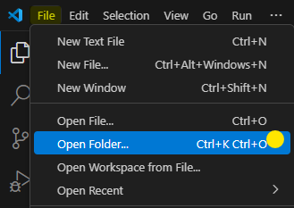

# Live Server
Ao decorrer de um projeto nos deparamos com a necessidade de testa-lo e manipulá-lo de forma fácil e eficiente, certo? Para isso usamos o Live Server, uma extensão no VSCode que descomplica nossa vida como desenvolvedores e aumenta a produtividade e rapidez em nossos projetos. 

# Como baixar o live server
Para baixar o live server você precisa ter o vscode instalado na sua máquina. A maioria das extensões não podem ser utilizadas através do site do vscode, e o Live Server é uma dessas extensões, fique atento, hein! \
Sabendo disso, prontos pra começar?

## Instalação do Live Server

* A primeira coisa que você vai fazer é abrir seu VSCode e ir na aba de extensões 

 

 

* Na barra de pesquisa, procure por "Live Server" do autor **Ritwick Dey**

 

**Obs: fiquem atentos ao nome do autor quando for baixarem! para não baixarem de outra extensão.**

* Depois de instalada a extensão, habilite-a para ser usada em seu editor de código

### Agora é a hora de testar. Bora lá?

* Abra a pasta de algum projeto que você tenha na sua máquina. 

 

 

* No canto inferior à direita, você encontrará o botão do live server para abrir um servidor local, que além de hospedar seu projeto, atualiza em tempo real.

 
Ao abrir, ficará dessa forma: 

 
 

> A extensão irá abrir o servidor local em um navegador padrão que está configurado por padrão. Você pode mudar o navegador indo naquela página da extensão (em que a baixamos) e configurar o navegador da sua preferência.

 

(No meu caso, estou abrindo um dos meus projetos desenvolvidos através de aulas de lógica de programação com JavaScript, o Freeway, um jogo bastante conhecido e que tenho certeza que você já jogou alguma vez quando era menor. Ficou interessado (a)? Dê uma olhadinha no projeto!)

Espero ter ajudado! Bons estudos, Dev! Nos vemos no próximo projeto :)

# Conheça alguns do meus projetos!

## <a href="https://github.com/JulieCamilo/404ERROR"> 404 ERROR </a>

O 404 ERROR é um site de pizzaria responsivo desenvolvido como projeto final do curso técnico de tecnologia da informação pelo Senac.

## <a href="https://github.com/JulieCamilo/Pong"> Pong </a>

O Pong é um jogo eletrônico com a temática de tênis de mesa e, é um dos primeiros jogos eletrônicos lucrativos da história.

